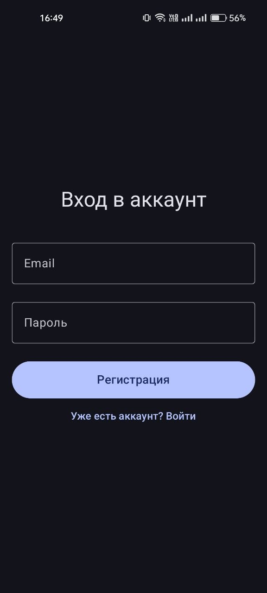
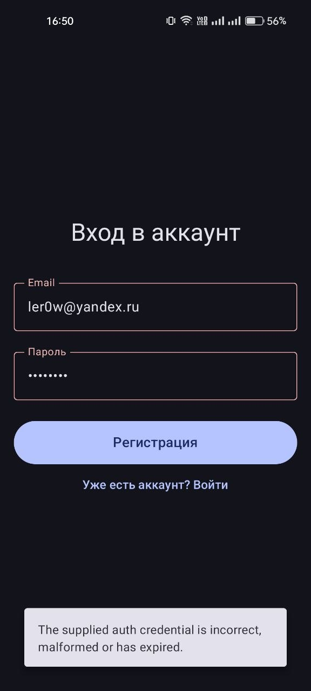
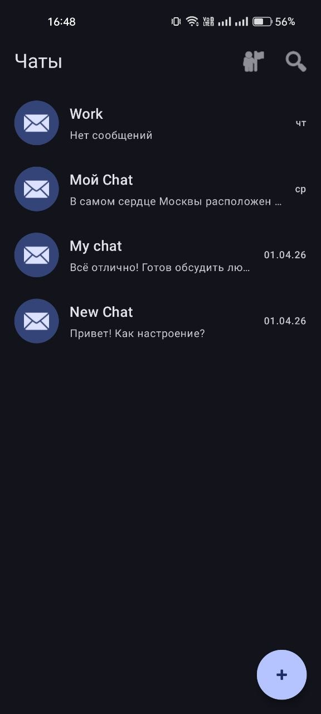
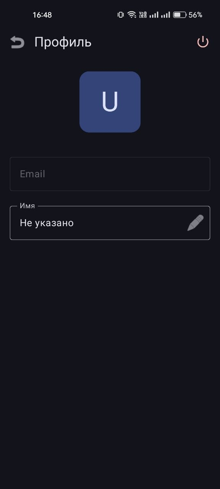
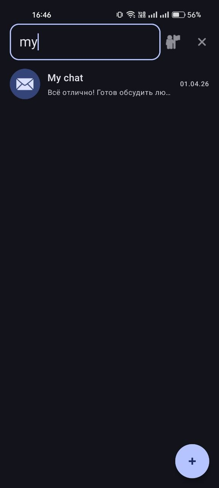
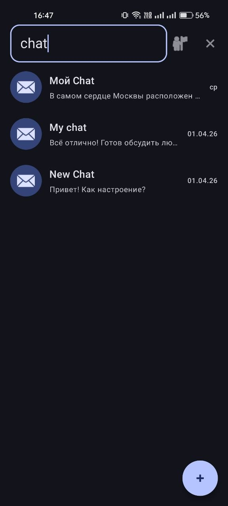
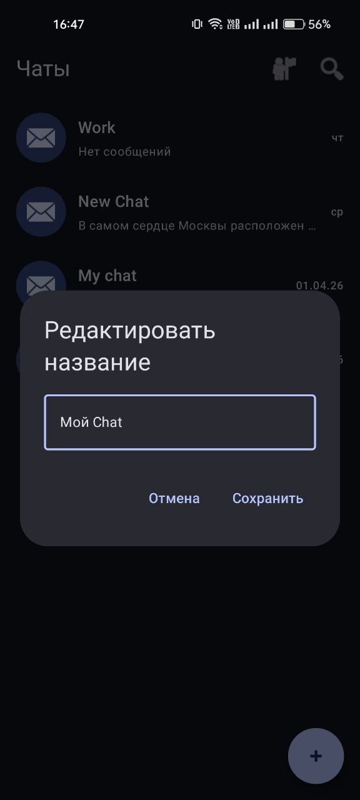
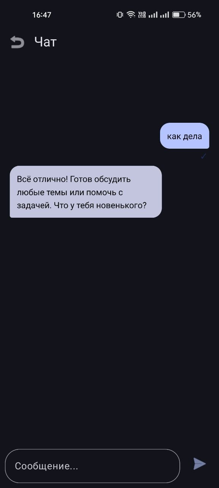

# Giga Chat Pet

Android-приложение на Kotlin + Jetpack Compose с авторизацией через Firebase и чат-интерфейсом для GigaChat API.

---
## Скриншоты

<div align="center">
  
  
  
  
  
  
  
  
</div>
---

## Что умеет приложение

- Регистрация и вход по Email/Password (Firebase Authentication).
- Проверка активной сессии при запуске.
- Список диалогов с пагинацией (Paging 3).
- Поиск по диалогам.
- Переименование и удаление диалогов.
- Экран чата с историей сообщений (Room).
- Отправка сообщений в GigaChat API.
- Повторная отправка при ошибках + экспоненциальные ретраи на уровне репозитория.
- Рендеринг Markdown-ответов (таблицы, task list, strikethrough) через Markwon.
- Профиль пользователя: отображение и обновление имени, выход из аккаунта.

## Технологии

- Kotlin 2.2.10
- Android Gradle Plugin 9.1.0
- Jetpack Compose + Material 3
- Hilt (DI)
- Retrofit + OkHttp
- Room
- Paging 3
- Firebase Auth
- Markwon

## Архитектура

Проект построен в многослойном стиле:

- `ui/` и `presentation/`: экраны, UI-модели, состояния.
- `domain/`: модели предметной области, интерфейсы репозиториев, use case.
- `data/`: API, локальная БД (Room), реализации репозиториев, мапперы.
- `di/`: Hilt-модули зависимостей.
- `navigation/`: граф навигации приложения.

Навигационные маршруты:

- `login`
- `chat_list`
- `chat/{conversationId}`
- `profile`

## Требования

- Android Studio (актуальная stable-версия с поддержкой AGP 9.x)
- JDK 11
- Android SDK:
  - `minSdk = 24`
  - `targetSdk = 36`
  - `compileSdk = 36`

## Настройка проекта

### 1. Firebase

1. Создайте Firebase-проект.
2. Подключите Android-приложение с package name `com.example.giga_chat_pet`.
3. Скачайте `google-services.json`.
4. Положите файл в папку:

```text
app/google-services.json
```

5. В Firebase Authentication включите провайдер Email/Password.

### 2. Ключи GigaChat

В `local.properties` (в корне проекта) добавьте:

```properties
gigachat.auth.key=<BASE64_CLIENT_ID_COLON_CLIENT_SECRET>
gigachat.scope=GIGACHAT_API_PERS
```

Где:

- `gigachat.auth.key` - Base64 от строки `ClientID:ClientSecret`.
- `gigachat.scope` - обычно `GIGACHAT_API_PERS` (для физ. лица) или `GIGACHAT_API_CORP` (для юр. лица).

Важно:

- Не коммитьте реальные ключи и `local.properties` в git.
- В проекте есть пример формата в `files/local.properties.example`, но рабочие ключи читаются именно как `gigachat.auth.key` и `gigachat.scope`.

## Сборка и запуск

### Через Android Studio

1. Откройте проект.
2. Дождитесь Gradle Sync.
3. Запустите конфигурацию `app` на эмуляторе/устройстве.

### Через Gradle

```bash
./gradlew :app:assembleDebug
./gradlew :app:installDebug
```

## Сетевые endpoints

- Получение OAuth-токена GigaChat:
  - `https://ngw.devices.sberbank.ru:9443/api/v2/oauth`
- Чат-комплишены:
  - `https://gigachat.devices.sberbank.ru/api/v1/chat/completions`

## Безопасность и данные

- Токен GigaChat кэшируется в памяти с обновлением до истечения срока.
- История сообщений и диалоги сохраняются локально в Room.
- Профиль пользователя хранится локально и синхронизируется с Firebase профилем при обновлении имени.

## Структура проекта (кратко)

```text
app/src/main/java/com/example/giga_chat_pet/
  data/
  di/
  domain/
  navigation/
  presentation/
  ui/
```

## Лицензия

Лицензия не указана.
